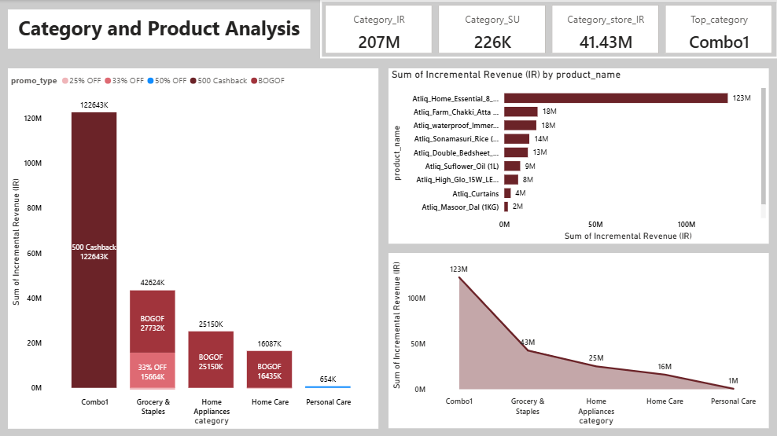
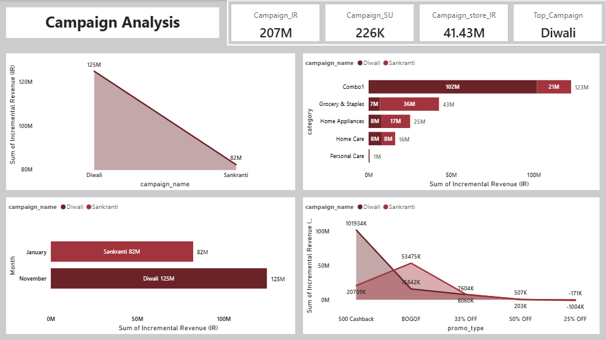

# Atli-Q Store Analysis
## Project Summary
AtliQ Mart ran multiple promotional campaigns across 50+ stores in South India during the Diwali 2023 and Sankranti 2024 festive seasons. The objective of this project was to analyze the effectiveness of these promotions and identify which offers, stores, categories, and products generated real business value.

This analysis focuses on incremental performance, measuring additional revenue and units sold due to promotions rather than total sales. The dashboard evaluates store-level performance, promotion type impact, category and product contribution, and campaign-wise comparison.

Key insights show that cashback-based promotions and combo categories delivered the highest incremental revenue, while flat discount offers like 25% OFF resulted in negative impact. The Diwali campaign significantly outperformed Sankranti, highlighting the importance of allocating higher budgets and better inventory planning for major festivals.

Overall, this project demonstrates how data-driven analysis can help retail businesses optimize promotional strategies, reduce value loss, and improve decision-making for future campaigns.

[Click here to view Live dashboard](https://app.powerbi.com/view?r=eyJrIjoiNTI5ODk5NTMtNDUxMy00N2E0LWE1ZTgtMGRjMTk4OWMzYzgyIiwidCI6IjNmZmZmN2I2LTdlZjQtNGZhNC04ZmVhLTc5OGFiMDQ1NTcxNCJ9)

## Table of Content
1. [About the Company](#about-the-company)
2. [Clients Requirements & Objectives](#clients-requirements--objectives)
3. [Key KPIs Overview](#key-kpis-overview)
4. [Store Performance Analysis](#store-performance-analysis)
5. [Promotion Type Analysis](#promotion-type-analysis)
6. [Category and Product Analysis](#category-and-product-analysis)
7. [Campaign Comparison: Diwali vs Sankranti](#campaign-comparison-diwali-vs-sankranti)
8. [Final Recommendations](#final-recommendations)
9. [Conclusion](#conclusion)

## About the Company 
Atli-Q Mart is a large retail chain with 50+ stores across South India. During the festive seasons of Diwali 2023 and Sankranti 2024, the company ran multiple promotions on Atli-Q branded products. These promotions included cashback offers, BOGOF deals, and percentage discounts.

## Clients Requirements & Objectives
The Sales Director wants to clearly understand:
- Which promotions worked well
-	Which promotions failed or caused loss
- Which stores, categories, and products benefited the most
The goal of this analysis is to support better promotional planning for future festivals.

## Key KPIs Overview
The overall performance of both campaigns is summarized below:
- Total Incremental Revenue: 207M
- Total Incremental Sold Units: 226K
- Average Incremental Revenue per Store: 41.43M
- Top Performing Store: STMYS-1
- Top Performing Promotion: 500 Cashback
- Top Category: Combo1
- Best Campaign: Diwali
These KPIs indicate that promotions had a strong overall impact, but performance varied widely across promotion types and categories.

[Home](#table-of-content)

## Store Performance Analysis

## Key Observations
- STMYS-1 generated the highest incremental revenue (~6.4M), making it the best-performing store.
- Stores like STCHE-4, STBLR-0, and STBLR-7 also performed consistently well.
- Revenue contribution was uneven across cities, with a few stores driving a large share of total gains.

[Home](#table-of-content)

## Promotion Type Analysis

## Revenue Performance
-	500 Cashback delivered the highest incremental revenue (123M).
-	BOGOF ranked second with 69M incremental revenue.
-	33% OFF generated limited gains.
-	25% OFF resulted in negative incremental revenue, indicating value loss.
## Volume vs Value Trade-off
- BOGOF drove higher units sold but at lower revenue efficiency.
- Cashback offers balanced both volume and revenue effectively.

[Home](#table-of-content)

## Category and Product Analysis

## Category-Level Findings
- Combo1 category alone contributed 123M incremental revenue.
- Grocery & Staples and Home Appliances showed moderate uplift.
- Personal Care contributed minimal revenue.
## Product-Level Findings
Top contributing products include:
- Atli-Q Home Essentials
- Atli-Q Farm Chakki Atta
- Atli-Q Waterproof Mattress

[Home](#table-of-content)

## Campaign Comparison: Diwali vs Sankranti

## Performance Summary
- Diwali Campaign: 125M incremental revenue
- Sankranti Campaign: 82M incremental revenue
Diwali outperformed Sankranti across most categories and promotion types.
## Promotion Behaviour by Campaign
- Cashback promotions worked best during Diwali.
- BOGOF performed relatively better during Sankranti but still lagged behind cashback offers.

[Home](#table-of-content)

## Final Recommendations
### 1.	Scale Cashback Promotions
- Focus on 500 Cashback for major festivals.
### 2.	Reduce or Stop Flat Discounts
- 25% OFF promotions are value destructive.
### 3.	Push Combo Categories
-	Combo1 should be a core focus area for future campaigns.
### 4.	Learn from Top Stores
-	Use high-performing stores as execution benchmarks.
### 5.	Invest More in Diwali Campaigns
-	Allocate higher inventory and marketing budgets during Diwali.

[Home](#table-of-content)

## Conclusion

The analysis highlights that promotional effectiveness varies significantly across offer types, categories, and campaigns. Cashback-based promotions, especially 500 Cashback, delivered the strongest incremental revenue, while flat discount offers such as 25% OFF resulted in value loss. Combo-based categories emerged as the highest contributors, indicating strong customer preference for bundled products.

Campaign comparison shows that Diwali outperformed Sankranti, suggesting that major festivals require higher budget allocation and stronger promotional focus. Overall, focusing on high-impact promotions, scaling successful categories, and learning from top-performing stores can help improve the effectiveness and profitability of future festive campaigns.

[Home](#table-of-content)
